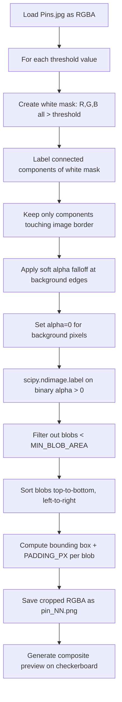

# Pin Background Removal and Extraction Script

## Goal

Write a Python script that:
1. Loads `Images&Content/Pins.jpg`
2. Replaces white/near-white pixels with transparency using a configurable threshold
3. Detects individual pin blobs (connected non-transparent regions)
4. Exports each blob as a separate PNG with tight bounding box plus padding
5. Supports running at multiple thresholds for side-by-side comparison

## Output Structure

```
Images&Content/Pins/
  threshold_235/
    pin_01.png
    pin_02.png
    ...
    pin_11.png
    composite_preview.png   (all pins on checkerboard for quick visual check)
  threshold_240/
    ...
  threshold_245/
    ...
```

## Script Location

`scripts/extract_pins.py` (per user rule: scripts in a dedicated folder)

## Dependencies

- `Pillow` (image loading/saving, RGBA conversion)
- `numpy` (fast pixel-level threshold operations)
- `scipy` (connected-component labeling via `scipy.ndimage.label` to find individual blobs)

A `requirements.txt` will be created at `scripts/requirements.txt`.

## Algorithm



## Configuration Variables (top of script)

```python
THRESHOLDS = [230, 235, 240, 245, 250]  # White-detection thresholds to compare
PADDING_PX = 15                          # Pixels of padding around each blob bbox
MIN_BLOB_AREA = 90_000                   # Minimum non-transparent pixel count (300^2)
SOFT_EDGE_RANGE = 10                     # Gradual alpha falloff zone (threshold-10 to threshold)
INPUT_PATH = "../Images&Content/Pins.jpg"
OUTPUT_BASE_DIR = "../Images&Content/Pins"
```

## Key Design Decisions

- **Threshold as a variable**: `THRESHOLDS` list at top of script. Each value produces its own output folder for comparison.
- **Padding around blobs**: 15px default padding around each detected blob bounding box to ensure shadows are not clipped at any edge. Clamped to image bounds.
- **Minimum blob area**: 90,000 px^2 (equivalent to a 300x300 square). At 4500x4500, each pin is roughly 600-900px across including shadow, so this cleanly filters JPEG artifact specks without risking loss of any real pin.
- **Soft-edge alpha falloff**: For pixels in the range `[threshold - SOFT_EDGE_RANGE, threshold]`, alpha is interpolated linearly from 255 (fully opaque) to 0 (fully transparent). This produces smooth semi-transparent edges instead of hard jagged cutoffs around shadow boundaries.
- **Blob sorting**: Blobs are sorted by position (top-to-bottom, then left-to-right) so pin numbering is consistent and predictable across threshold runs.
- **Preview composite**: A single image showing all extracted pins tiled on a checkerboard background (alternating light/dark gray squares). This allows instant visual assessment of shadow quality without opening 11 individual files.
- **Glint preservation via border flood-fill**: Rather than globally removing all white pixels, the script labels connected components of the white mask and only removes those connected to the image border. White pixels *inside* pin heads (specular highlights/glints) are isolated islands not connected to the border, so they stay fully opaque automatically. No post-processing or "add-back" step needed.
- **No alpha on colored pixels**: The threshold only operates on "whitish" pixels. Any pixel where any channel is well below the threshold is guaranteed to remain fully opaque, so pin colors are never accidentally made semi-transparent.

## Implementation Details

### Setup
1. **No venv exists** in this project currently. Create one at `scripts/venv/`, activate it, install deps from `scripts/requirements.txt`.
2. Add `scripts/venv/` and `__pycache__/` to `.gitignore`.

### Background Removal Function (`remove_background`)
- Load JPEG with `PIL.Image.open().convert("RGBA")` -- produces a 4500x4500x4 numpy array.
- Create boolean mask: `white_mask = (R > threshold) & (G > threshold) & (B > threshold)`.
- **Glint preservation** (border flood-fill approach):
  1. Label connected components within `white_mask` using `scipy.ndimage.label`.
  2. For each labeled white region, check if it touches any image border (row 0, row H-1, col 0, col W-1).
  3. Only border-connected white regions are marked as "background". Interior white islands (specular highlights/glints on pin heads) remain fully opaque.
  4. This ensures pin head glints are never removed regardless of threshold.
- For the soft edge: identify pixels in the "near-white" zone adjacent to background regions where each channel is between `threshold - SOFT_EDGE_RANGE` and `threshold`. Compute their alpha as `255 * (threshold - max(R,G,B)) / SOFT_EDGE_RANGE` (linear ramp). Only apply this to pixels bordering the background mask (not interior white).
- Set `alpha[background_mask] = 0`.
- Return the modified RGBA array.

### Blob Detection Function (`detect_blobs`)
- Create binary mask from alpha channel: `binary = (alpha > 0).astype(np.uint8)`.
- Run `scipy.ndimage.label(binary)` to get labeled array + number of features.
- For each label, compute pixel count via `np.sum(labeled == i)`. Discard if < `MIN_BLOB_AREA`.
- For remaining blobs, compute bounding box via `scipy.ndimage.find_objects()`.
- Expand each bbox by `PADDING_PX` in all directions (clamped to 0..4499).
- Sort blobs by (center_y, center_x) for consistent numbering.
- Return list of bounding box slices.

### Export Function (`export_pins`)
- For each bbox slice, crop the RGBA array and save as `pin_NN.png` (zero-padded two digits).
- Generate checkerboard preview: tile all pin images in a grid (e.g., 4 columns), each scaled to fit 400px max dimension, on a 32px checkerboard background.
- Save composite as `composite_preview.png`.
- Print: pin ID, dimensions, file size.

### Main Entry Point
- Loop over `THRESHOLDS`, create `OUTPUT_BASE_DIR/threshold_{t}/` for each.
- Call `remove_background(img, t)` -> `detect_blobs(result)` -> `export_pins(blobs, ...)`.
- Print summary: threshold value, blob count, total output size.

### Performance
- The source image is 4500x4500 (20.25 megapixels). Processing will take a few seconds per threshold due to the numpy/scipy operations on ~80MB of pixel data. Total runtime for 5 thresholds: ~15-30 seconds.

## Files to Create

| File | Purpose |
|------|---------|
| `scripts/extract_pins.py` | Main extraction script |
| `scripts/requirements.txt` | Pillow, numpy, scipy |

## Files to Modify

| File | Change |
|------|--------|
| `.gitignore` | Add `scripts/venv/` if not already excluded |

## After Running

Once you pick the threshold that looks best, we can:
- Move the chosen pin PNGs into `Images&Content/Pins/` as the final assets
- Update `visual-config.json` / `PinImageConfig` to point to individual files instead of cropping from the master JPEG
