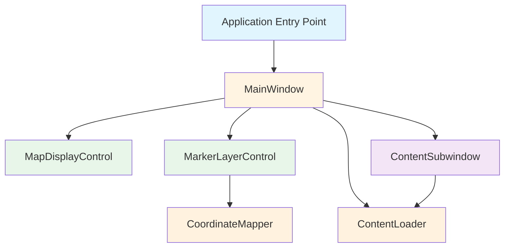
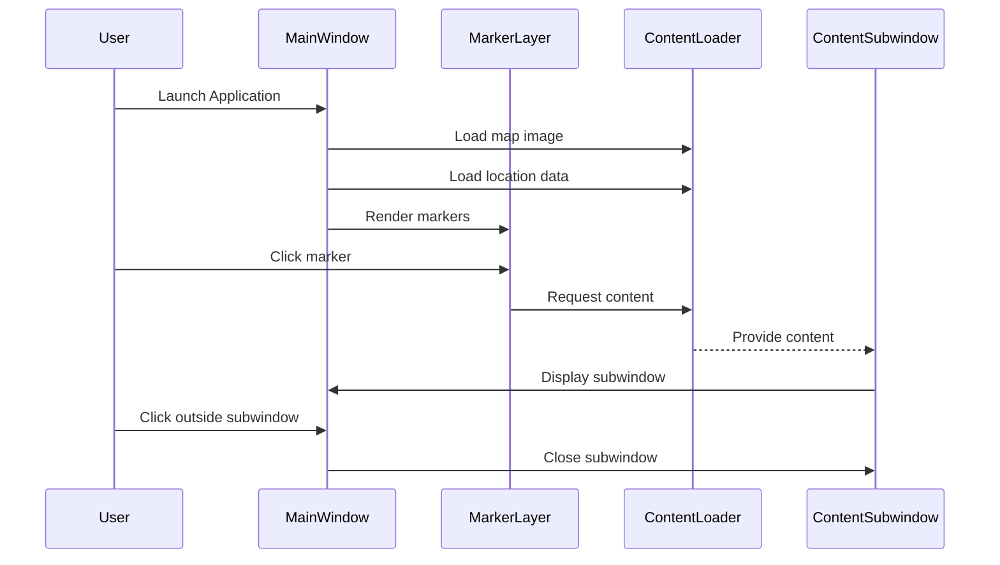

# Design Document: Interactive World Map

## Overview

The Interactive World Map is a Windows desktop application that provides an immersive, full-screen geographic exploration experience. The application displays a high-resolution world map with interactive location markers that users can click to view detailed content in popup subwindows.

### Core Architecture

The application follows a layered architecture with clear separation between rendering, interaction handling, and content management:

- **Presentation Layer**: Handles full-screen rendering, UI components, and visual feedback
- **Interaction Layer**: Manages user input, click detection, and event routing
- **Content Layer**: Loads and manages map images and location-specific content
- **Coordinate System**: Translates geographic coordinates to screen positions

### Technology Stack

- **Framework**: Windows Presentation Foundation (WPF) with .NET 6.0+
- **Language**: C# 10.0+
- **Graphics**: WPF Image controls with hardware acceleration
- **UI Animations**: WPF Storyboard and DoubleAnimation for smooth transitions

### Key Design Decisions

1. **WPF over WinForms**: WPF provides superior graphics rendering, built-in animation support, and better high-DPI scaling
2. **Canvas-based Layout**: Using WPF Canvas for absolute positioning of markers enables precise coordinate mapping
3. **MVVM Pattern**: Separates UI logic from business logic for maintainability and testability
4. **Event-driven Architecture**: Click and hover events drive state changes and UI updates

## Architecture

### Component Diagram



### System Flow



### Layer Responsibilities

**Presentation Layer**
- MainWindow: Full-screen window management, escape key handling
- MapDisplayControl: Renders world map image with proper scaling
- MarkerLayerControl: Renders and manages location markers
- ContentSubwindow: Displays location-specific content in popup window

**Interaction Layer**
- InputHandler: Processes mouse clicks and hover events
- MarkerHitTest: Determines if click intersects with marker
- FocusManager: Manages which UI element has focus

**Content Layer**
- ContentLoader: Loads images and text from Content_Folder
- LocationDataStore: Maintains mapping of locations to content files
- CoordinateMapper: Converts lat/long to screen pixel coordinates

## Components and Interfaces

### MainWindow Component

**Responsibility**: Root window that hosts all UI components and manages application lifecycle

**Interface**:
```csharp
public class MainWindow : Window
{
    // Properties
    public MapDisplayControl MapDisplay { get; }
    public MarkerLayerControl MarkerLayer { get; }
    public ContentSubwindow? ActiveSubwindow { get; private set; }
    
    // Methods
    public void Initialize();
    public void ShowContentForLocation(Location location);
    public void CloseActiveSubwindow();
    public void HandleOutsideClick(Point clickPosition);
    
    // Events
    public event EventHandler<LocationClickedEventArgs> LocationClicked;
    public event EventHandler SubwindowClosed;
}
```

**Key Behaviors**:
- Initializes in full-screen mode (WindowState.Maximized, WindowStyle.None)
- Handles Escape and Alt+F4 for application exit
- Routes click events to appropriate handlers
- Manages z-order of subwindow over map

### MapDisplayControl Component

**Responsibility**: Renders the world map image with proper scaling and aspect ratio preservation

**Interface**:
```csharp
public class MapDisplayControl : UserControl
{
    // Properties
    public ImageSource MapImage { get; set; }
    public Size ActualMapSize { get; }
    public Rect MapBounds { get; }
    
    // Methods
    public void LoadMapImage(string imagePath);
    public Point GetMapPosition(double latitude, double longitude);
    public bool IsPointOnMap(Point screenPoint);
}
```

**Key Behaviors**:
- Uses WPF Image control with Stretch.Uniform for aspect ratio preservation
- Calculates actual rendered map bounds for coordinate mapping
- Supports high-DPI displays through WPF's automatic scaling

### MarkerLayerControl Component

**Responsibility**: Renders location markers and handles marker interactions

**Interface**:
```csharp
public class MarkerLayerControl : Canvas
{
    // Properties
    public ObservableCollection<LocationMarker> Markers { get; }
    
    // Methods
    public void AddMarker(Location location);
    public void RemoveMarker(LocationMarker marker);
    public LocationMarker? HitTest(Point position);
    public void UpdateMarkerPositions();
    
    // Events
    public event EventHandler<MarkerClickedEventArgs> MarkerClicked;
    public event EventHandler<MarkerHoverEventArgs> MarkerHovered;
}
```

**Key Behaviors**:
- Renders markers as Ellipse shapes with gradient fills
- Applies scale transform on hover (1.0 → 1.2 scale)
- Uses CoordinateMapper to position markers correctly
- Implements efficient hit testing using WPF's VisualTreeHelper

### LocationMarker Component

**Responsibility**: Visual representation of a clickable location on the map

**Interface**:
```csharp
public class LocationMarker : Control
{
    // Properties
    public Location Location { get; set; }
    public Point ScreenPosition { get; set; }
    public bool IsHovered { get; set; }
    
    // Methods
    public void AnimateHover(bool isEntering);
    public void AnimateClick();
    public bool ContainsPoint(Point point);
}
```

**Key Behaviors**:
- Default size: 12x12 pixels (visible but not obtrusive)
- Hover animation: 200ms ease-out scale to 1.2x
- Click animation: 100ms pulse effect
- Visual style: Circular with radial gradient (center: white, edge: accent color)

### ContentSubwindow Component

**Responsibility**: Displays location-specific content in a popup window overlay

**Interface**:
```csharp
public class ContentSubwindow : Window
{
    // Properties
    public object Content { get; set; }
    public Location AssociatedLocation { get; set; }
    public Size PreferredSize { get; }
    
    // Methods
    public void ShowContent(object content, Point anchorPosition);
    public void AnimateOpen();
    public void AnimateClose(Action onComplete);
    public bool ContainsPoint(Point screenPoint);
}
```

**Key Behaviors**:
- Window style: Borderless with drop shadow
- Size: 400x300 pixels (adjustable based on content)
- Position: Centered on screen or near marker (avoiding screen edges)
- Open animation: 150ms fade-in with scale from 0.9 to 1.0
- Close animation: 100ms fade-out
- Content rendering: Image control for images, TextBlock for text

### ContentLoader Component

**Responsibility**: Loads and caches content from the Images&Content folder

**Interface**:
```csharp
public class ContentLoader
{
    // Properties
    public string ContentFolderPath { get; }
    public bool IsInitialized { get; }
    
    // Methods
    public Task<ImageSource> LoadMapImageAsync();
    public Task<List<Location>> LoadLocationsAsync();
    public Task<object> LoadLocationContentAsync(Location location);
    public bool ValidateContentFolder();
    
    // Events
    public event EventHandler<LoadErrorEventArgs> LoadError;
}
```

**Key Behaviors**:
- Content folder path: "./Images&Content" relative to executable
- Supported image formats: .png, .jpg, .jpeg, .bmp
- Caches loaded images to avoid repeated disk I/O
- Validates folder structure on initialization
- Throws descriptive exceptions for missing files

### CoordinateMapper Component

**Responsibility**: Converts geographic coordinates to screen pixel positions

**Interface**:
```csharp
public class CoordinateMapper
{
    // Properties
    public Rect MapBounds { get; set; }
    public Size ScreenSize { get; set; }
    
    // Methods
    public Point LatLongToScreen(double latitude, double longitude);
    public (double lat, double lon) ScreenToLatLong(Point screenPoint);
    public void UpdateProjection(Rect newMapBounds);
}
```

**Key Behaviors**:
- Uses Equirectangular projection (simple linear mapping)
- Latitude range: -90° to +90° (bottom to top)
- Longitude range: -180° to +180° (left to right)
- Accounts for actual rendered map bounds (not full screen)
- Updates mapping when window is resized or DPI changes

### Location Data Model

**Responsibility**: Represents a geographic location with associated content

```csharp
public class Location
{
    public string Id { get; set; }
    public string Name { get; set; }
    public double Latitude { get; set; }
    public double Longitude { get; set; }
    public string ContentFilePath { get; set; }
    public LocationContentType ContentType { get; set; }
}

public enum LocationContentType
{
    Image,
    Text
}
```

## Data Models

### Location Configuration Format

Locations are defined in a JSON configuration file stored in the Content_Folder:

```json
{
  "locations": [
    {
      "id": "loc_001",
      "name": "Sample Location",
      "latitude": 40.7128,
      "longitude": -74.0060,
      "contentFile": "sample_content.jpg",
      "contentType": "image"
    }
  ]
}
```

### Content Folder Structure

```
Images&Content/
├── world_map.png          # Main world map image
├── locations.json         # Location configuration
├── sample_content.jpg     # Location content files
├── another_location.png
└── text_content.txt
```

### Application State Model

```csharp
public class ApplicationState
{
    public ImageSource MapImage { get; set; }
    public List<Location> Locations { get; set; }
    public Location? ActiveLocation { get; set; }
    public bool IsSubwindowOpen { get; set; }
    public Dictionary<string, object> ContentCache { get; set; }
}
```

### Event Models

```csharp
public class LocationClickedEventArgs : EventArgs
{
    public Location Location { get; set; }
    public Point ClickPosition { get; set; }
}

public class MarkerHoverEventArgs : EventArgs
{
    public LocationMarker Marker { get; set; }
    public bool IsEntering { get; set; }
}

public class LoadErrorEventArgs : EventArgs
{
    public string ErrorMessage { get; set; }
    public Exception Exception { get; set; }
}
```


## Correctness Properties

*A property is a characteristic or behavior that should hold true across all valid executions of a system—essentially, a formal statement about what the system should do. Properties serve as the bridge between human-readable specifications and machine-verifiable correctness guarantees.*

### Property 1: Aspect Ratio Preservation During Scaling

*For any* world map image with any aspect ratio and any screen resolution, when the map is displayed, the rendered aspect ratio SHALL match the source image aspect ratio, and the image SHALL fit within the screen bounds without distortion.

**Validates: Requirements 1.2, 1.3**

### Property 2: Marker Rendering Completeness

*For any* set of locations with valid geographic coordinates, the application SHALL render exactly one visible location marker for each location in the visual tree.

**Validates: Requirements 2.1**

### Property 3: Coordinate Mapping Accuracy

*For any* location with valid latitude and longitude coordinates and any screen resolution, the location marker SHALL be positioned at the mathematically correct screen position according to the Equirectangular projection, maintaining relative geographic accuracy across all display configurations.

**Validates: Requirements 2.2, 2.5**

### Property 4: Marker Hover Feedback

*For any* location marker, when a mouse hover event occurs over the marker, the marker SHALL trigger a visual state change (animation or property update) within the specified time threshold.

**Validates: Requirements 2.4**

### Property 5: Marker Click Opens Subwindow

*For any* location marker, when clicked, the application SHALL open a content subwindow that displays the content associated with that specific location.

**Validates: Requirements 3.1**

### Property 6: Subwindow Z-Order

*For any* opened content subwindow, the subwindow SHALL be rendered with a higher z-index than the map display, ensuring it appears as an overlay.

**Validates: Requirements 3.2**

### Property 7: Content Type Rendering

*For any* location content, the content subwindow SHALL render the content using the appropriate display control based on content type (Image control for image files, TextBlock for text content).

**Validates: Requirements 3.3, 3.4**

### Property 8: Map Visibility Behind Subwindow

*For any* opened content subwindow, the map display SHALL remain in the visual tree and maintain visibility (not be completely obscured or hidden).

**Validates: Requirements 3.6**

### Property 9: Outside Click Closes Subwindow

*For any* open content subwindow and any click position on the map display that is outside the subwindow's bounds, the application SHALL close the content subwindow.

**Validates: Requirements 4.1**

### Property 10: Marker Click Replaces Active Subwindow

*For any* two distinct locations where the first location's subwindow is currently open, when the second location's marker is clicked, the application SHALL close the first subwindow and open a new subwindow displaying the second location's content, ensuring only one subwindow is active.

**Validates: Requirements 4.2**

### Property 11: Focus Return on Subwindow Close

*For any* content subwindow closure event, the application SHALL return keyboard and interaction focus to the map display component.

**Validates: Requirements 4.3**

### Property 12: Image Format Support

*For any* location content file in a supported image format (PNG, JPG, JPEG, BMP), the application SHALL successfully load and display the image in the content subwindow without errors.

**Validates: Requirements 5.5**

### Property 13: Marker Animation on Interaction

*For any* location marker, when hover or click interactions occur, the marker SHALL initiate an animation (scale, opacity, or transform) that provides visual feedback.

**Validates: Requirements 6.2**

### Property 14: Subwindow Animation on State Change

*For any* content subwindow open or close operation, the subwindow SHALL apply a smooth animation (fade, scale, or slide) during the state transition.

**Validates: Requirements 6.3**

### Property 15: Marker Click Response Time

*For any* location marker click event, the content subwindow SHALL begin its opening animation within 100 milliseconds of the click event timestamp.

**Validates: Requirements 7.1**

### Property 16: Subwindow Close Response Time

*For any* click event outside an open content subwindow, the subwindow SHALL begin its closing animation within 100 milliseconds of the click event timestamp.

**Validates: Requirements 7.2**

### Property 17: Hover Feedback Response Time

*For any* mouse hover event over a location marker, the visual feedback (animation or state change) SHALL begin within 50 milliseconds of the hover event timestamp.

**Validates: Requirements 7.3**

### Property 18: Window Management Support

*For any* standard Windows window management operation (minimize, maximize, close), the application SHALL respond correctly by executing the requested operation and updating its window state accordingly.

**Validates: Requirements 8.2**

### Property 19: Resource Cleanup on Exit

*For any* application closure event, all allocated system resources (file handles, image memory, window handles) SHALL be properly disposed and released, leaving no resource leaks.

**Validates: Requirements 8.5**

## Error Handling

### Error Categories

**Content Loading Errors**
- Missing Content_Folder
- Missing world map image file
- Corrupted or invalid image files
- Missing location configuration file
- Invalid JSON in configuration

**Runtime Errors**
- Invalid geographic coordinates (out of range)
- File access permission errors
- Out of memory conditions
- Invalid content file paths

### Error Handling Strategy

**Startup Validation**
```csharp
public class StartupValidator
{
    public ValidationResult ValidateEnvironment()
    {
        var result = new ValidationResult();
        
        // Check Content_Folder exists
        if (!Directory.Exists(ContentFolderPath))
        {
            result.AddError("Content folder not found at: " + ContentFolderPath);
            result.IsCritical = true;
        }
        
        // Check world map image exists
        var mapPath = Path.Combine(ContentFolderPath, "world_map.png");
        if (!File.Exists(mapPath))
        {
            result.AddError("World map image not found at: " + mapPath);
            result.IsCritical = true;
        }
        
        // Check locations.json exists and is valid
        var locationsPath = Path.Combine(ContentFolderPath, "locations.json");
        if (!File.Exists(locationsPath))
        {
            result.AddWarning("Locations file not found. No markers will be displayed.");
        }
        else
        {
            try
            {
                var json = File.ReadAllText(locationsPath);
                JsonSerializer.Deserialize<LocationConfiguration>(json);
            }
            catch (JsonException ex)
            {
                result.AddError("Invalid locations.json format: " + ex.Message);
            }
        }
        
        return result;
    }
}
```

**Error Display Strategy**
- Critical errors (missing folder, missing map): Show modal error dialog, prevent application start
- Non-critical errors (missing location content): Log warning, skip that location, continue
- Runtime errors: Show non-modal notification, allow continued use

**Graceful Degradation**
- If locations.json is missing: Display map without markers
- If individual content file is missing: Show "Content not available" message in subwindow
- If coordinate mapping fails: Skip that marker, log error

**Logging Strategy**
```csharp
public interface ILogger
{
    void LogError(string message, Exception? ex = null);
    void LogWarning(string message);
    void LogInfo(string message);
}
```

Log all errors to:
- Application event log (Windows Event Viewer)
- Local log file: `%APPDATA%/InteractiveWorldMap/logs/app.log`
- Console output (debug builds only)

### Coordinate Validation

```csharp
public class CoordinateValidator
{
    public bool IsValid(double latitude, double longitude)
    {
        return latitude >= -90.0 && latitude <= 90.0 &&
               longitude >= -180.0 && longitude <= 180.0;
    }
    
    public (double lat, double lon) Clamp(double latitude, double longitude)
    {
        var clampedLat = Math.Max(-90.0, Math.Min(90.0, latitude));
        var clampedLon = Math.Max(-180.0, Math.Min(180.0, longitude));
        return (clampedLat, clampedLon);
    }
}
```

### Exception Handling Patterns

**File I/O Operations**
```csharp
try
{
    var image = await LoadImageAsync(path);
    return image;
}
catch (FileNotFoundException ex)
{
    logger.LogError($"Content file not found: {path}", ex);
    return GetPlaceholderImage();
}
catch (UnauthorizedAccessException ex)
{
    logger.LogError($"Access denied to file: {path}", ex);
    ShowErrorNotification("Unable to access content file");
    return GetPlaceholderImage();
}
catch (Exception ex)
{
    logger.LogError($"Unexpected error loading content: {path}", ex);
    return GetPlaceholderImage();
}
```

**UI Operations**
```csharp
try
{
    ShowContentSubwindow(content);
}
catch (InvalidOperationException ex)
{
    logger.LogError("Failed to display content subwindow", ex);
    ShowErrorNotification("Unable to display content");
}
```

## Testing Strategy

### Dual Testing Approach

The testing strategy employs both unit tests and property-based tests to ensure comprehensive coverage:

- **Unit tests**: Verify specific examples, edge cases, error conditions, and integration points
- **Property-based tests**: Verify universal properties across randomized inputs to catch edge cases that might be missed by example-based testing

### Unit Testing Focus Areas

Unit tests should focus on:

1. **Specific Examples**
   - Application startup with valid content folder
   - Loading specific known locations
   - Opening and closing specific subwindows
   - Escape key and Alt+F4 exit functionality

2. **Edge Cases**
   - Empty locations list
   - Locations at extreme coordinates (poles, date line)
   - Very small or very large screen resolutions
   - Content files with unusual names or paths

3. **Error Conditions**
   - Missing Content_Folder (Requirement 5.3)
   - Missing world map image (Requirement 5.4)
   - Corrupted image files
   - Invalid JSON in locations.json
   - Invalid coordinate values

4. **Integration Points**
   - ContentLoader integration with file system
   - CoordinateMapper integration with MapDisplay
   - Event routing between components

### Property-Based Testing Configuration

**Framework**: Use FsCheck for .NET (C# compatible property-based testing library)

**Configuration**:
- Minimum 100 iterations per property test
- Each test must reference its design document property using a comment tag
- Tag format: `// Feature: interactive-world-map, Property {number}: {property_text}`

**Property Test Examples**:

```csharp
[Property]
// Feature: interactive-world-map, Property 3: Coordinate Mapping Accuracy
public Property CoordinateMapping_MaintainsRelativeAccuracy(
    double latitude, 
    double longitude, 
    int screenWidth, 
    int screenHeight)
{
    // Arrange: Constrain inputs to valid ranges
    var validLat = Math.Max(-90, Math.Min(90, latitude));
    var validLon = Math.Max(-180, Math.Min(180, longitude));
    var validWidth = Math.Max(800, Math.Min(3840, screenWidth));
    var validHeight = Math.Max(600, Math.Min(2160, screenHeight));
    
    var mapper = new CoordinateMapper
    {
        MapBounds = new Rect(0, 0, validWidth, validHeight),
        ScreenSize = new Size(validWidth, validHeight)
    };
    
    // Act: Convert to screen coordinates and back
    var screenPoint = mapper.LatLongToScreen(validLat, validLon);
    var (resultLat, resultLon) = mapper.ScreenToLatLong(screenPoint);
    
    // Assert: Round-trip should preserve coordinates within tolerance
    var latDiff = Math.Abs(resultLat - validLat);
    var lonDiff = Math.Abs(resultLon - validLon);
    
    return (latDiff < 0.01 && lonDiff < 0.01)
        .Label($"Coordinate round-trip failed: ({validLat}, {validLon}) -> ({resultLat}, {resultLon})");
}

[Property]
// Feature: interactive-world-map, Property 1: Aspect Ratio Preservation During Scaling
public Property AspectRatio_PreservedDuringScaling(
    int imageWidth,
    int imageHeight,
    int screenWidth,
    int screenHeight)
{
    // Arrange: Constrain to reasonable values
    var validImgWidth = Math.Max(100, Math.Min(4000, imageWidth));
    var validImgHeight = Math.Max(100, Math.Min(4000, imageHeight));
    var validScreenWidth = Math.Max(800, Math.Min(3840, screenWidth));
    var validScreenHeight = Math.Max(600, Math.Min(2160, screenHeight));
    
    var sourceAspectRatio = (double)validImgWidth / validImgHeight;
    
    var mapDisplay = new MapDisplayControl();
    var scaledSize = mapDisplay.CalculateScaledSize(
        new Size(validImgWidth, validImgHeight),
        new Size(validScreenWidth, validScreenHeight));
    
    var renderedAspectRatio = scaledSize.Width / scaledSize.Height;
    
    // Assert: Aspect ratios should match within floating point tolerance
    var aspectRatioDiff = Math.Abs(sourceAspectRatio - renderedAspectRatio);
    
    return (aspectRatioDiff < 0.001)
        .Label($"Aspect ratio not preserved: {sourceAspectRatio} -> {renderedAspectRatio}");
}

[Property]
// Feature: interactive-world-map, Property 7: Content Type Rendering
public Property ContentType_RendersWithCorrectControl(string contentPath)
{
    // Arrange: Generate various file extensions
    var extensions = new[] { ".png", ".jpg", ".jpeg", ".bmp", ".txt" };
    var ext = extensions[Math.Abs(contentPath.GetHashCode()) % extensions.Length];
    var testPath = "test_content" + ext;
    
    var location = new Location
    {
        ContentFilePath = testPath,
        ContentType = ext == ".txt" ? LocationContentType.Text : LocationContentType.Image
    };
    
    var subwindow = new ContentSubwindow();
    
    // Act: Load content
    subwindow.LoadContent(location);
    
    // Assert: Correct control type is used
    var isImageContent = location.ContentType == LocationContentType.Image;
    var usesImageControl = subwindow.ContentControl is Image;
    var usesTextControl = subwindow.ContentControl is TextBlock;
    
    return ((isImageContent && usesImageControl) || (!isImageContent && usesTextControl))
        .Label($"Wrong control for {location.ContentType}: Image={usesImageControl}, Text={usesTextControl}");
}
```

### Test Coverage Goals

- **Unit test coverage**: Minimum 80% code coverage
- **Property test coverage**: All 19 correctness properties must have corresponding property tests
- **Integration test coverage**: All component interactions tested
- **UI automation coverage**: Critical user workflows (marker click, subwindow close)

### Testing Tools

- **Unit Testing**: xUnit or NUnit
- **Property-Based Testing**: FsCheck for .NET
- **UI Automation**: FlaUI or Windows Application Driver
- **Mocking**: Moq for dependency mocking
- **Code Coverage**: Coverlet or dotCover

### Continuous Testing

- Run unit tests on every build
- Run property tests (100 iterations) on every commit
- Run extended property tests (1000 iterations) nightly
- Run UI automation tests before releases

### Performance Testing

While property-based tests verify functional correctness, performance requirements (7.1, 7.2, 7.3) should be validated through:

- Benchmark tests using BenchmarkDotNet
- Profiling with Visual Studio Profiler
- Manual testing on target hardware configurations

Performance tests should verify:
- Marker click to subwindow display: < 100ms
- Outside click to subwindow close: < 100ms
- Hover to visual feedback: < 50ms
