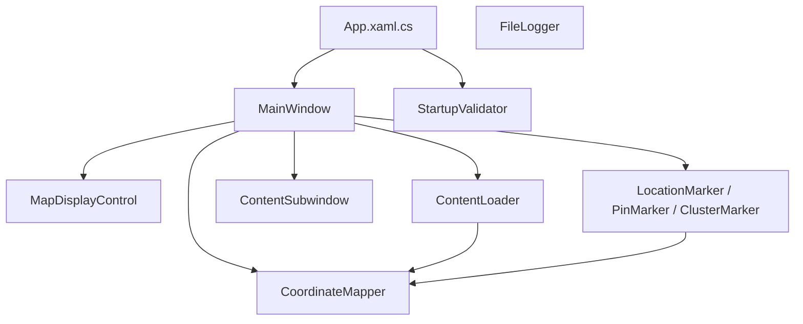

# Architecture — Interactive World Map

Top-level map for agents and engineers. Full design history: [.kiro/specs/interactive-world-map/design.md](.kiro/specs/interactive-world-map/design.md).

## Stack

- **Framework:** WPF on .NET 6.0-windows
- **Language:** C# 10
- **Pattern:** Layered MVVM (ViewModels folder reserved; logic currently in Services + code-behind)
- **Dependencies:** Newtonsoft.Json (JSON parsing)

## Component Diagram



## Layer Model

Allowed dependency direction (lower layers must not reference higher layers):

```
Models          (data, config, events — foundation)
  ↑
Utilities       (coordinate math, clustering, Excel helpers)
  ↑
Services        (content, logging, navigation, validation, caches)
  ↑
Views           (WPF controls — Models only)
  ↑
MainWindow/App  (composition root — wires everything)
```

### Layer Rules

| Layer | May reference | Must NOT reference |
|-------|---------------|-------------------|
| `Models` | System, Newtonsoft.Json | `Services`, `Utilities`, `Views` |
| `Utilities` | `Models`, `Services` (ILogger only) | `Views` |
| `Services` | `Models`, `Utilities` | `Views` |
| `Views` | `Models`, WPF framework | `Services`, `Utilities` |
| `MainWindow` / `App` | All layers | — |

Enforced by `Tests/Architecture/LayerDependencyTests.cs`.

## Cross-Cutting Concerns

### Logging

- Interface: `Services/ILogger.cs`
- Implementation: `Services/FileLogger.cs`
- Output: `%APPDATA%\InteractiveWorldMap\logs\app.log`
- See [docs/reference/RELIABILITY.md](docs/reference/RELIABILITY.md)

### Configuration

- File: `visual-config.json` (copied to output on build)
- Typed model: `Models/VisualConfig.cs` with `LoadFromFile()`
- Agents must edit JSON and ensure model deserialization still works

### Content

- Root: `Images&Content/`
- Loader: `Services/ContentLoader.cs` — sole authority for paths and caching
- Coordinates: `Coordinates for map.xlsx` (preferred) or `locations.json`

## Key Invariants (do not violate)

1. **Parse at boundary** — Deserialize config and location data into typed Models at load time.
2. **Content paths via ContentLoader** — Views and MainWindow must not construct `Images&Content` paths directly except through Services.
3. **Coordinate math in Utilities** — Projection and validation live in `CoordinateMapper` / `CoordinateValidator`.
4. **Views stay thin** — Event wiring and binding only; business logic belongs in Services.
5. **File size** — Keep source files under 800 lines; extract Services when code-behind grows (see [docs/assessments/REFACTORING_ASSESSMENT.md](docs/assessments/REFACTORING_ASSESSMENT.md)).
6. **No secrets in source** — Credentials and keys via environment or external config, never hardcoded.

## Domain Map

| Domain | Primary types | Location |
|--------|---------------|----------|
| Locations | `Location`, `LocationCluster` | `Models/` |
| Coordinates | `CoordinateMapper`, `CoordinateValidator` | `Utilities/` |
| Clustering | `LocationClusterer`, `ClusterCache` | `Utilities/`, `Services/` |
| Map display | `MapDisplayControl`, zoom state | `Views/`, `Models/ViewportState` |
| Markers | `LocationMarker`, `PinMarker`, `ClusterMarker` | `Views/` |
| Content popups | `ContentSubwindow`, `DidacticTextWindow` | `Views/` |
| Manual layout | `ManualLayoutManager`, `ManualLayout` | `Services/`, `Models/` |
| Radial extensions | `RadialExtensionCalculator` | `Utilities/` |
| Visual config | `VisualConfig` | `Models/`, `visual-config.json` |

## Known Technical Debt

Tracked in [docs/exec-plans/tech-debt-tracker.md](docs/exec-plans/tech-debt-tracker.md). Highlights:

- `MainWindow.xaml.cs` is a large composition root (god-object tendency)
- `ViewModels/` folder is empty — MVVM not fully adopted
- Property-based tests from Kiro design doc not yet implemented

## Verification

```bash
./scripts/verify.sh       # or scripts/verify.ps1 on Windows
```

Runs build, unit tests, architecture tests, taste checks, and doc link validation.
