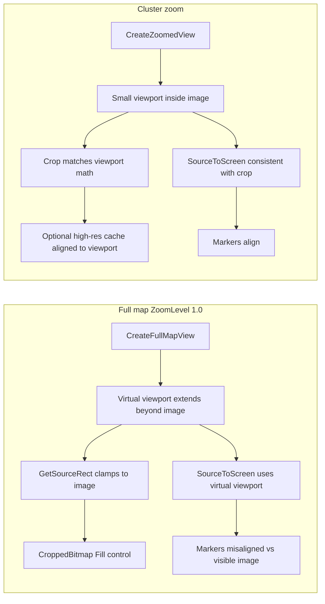

# Unzoomed Marker Offset — Investigation Assessment

Date: 2026-06-05
Status: Fixed 2026-06-06 — H1 confirmed; see fix summary below.
Related backlog: [TO_DO.md — High Priority → Bugs](TO_DO.md)

## Symptom (reported)

On the initial far-out (full-map) view, location/cluster markers appear shifted **right and down** relative to the map image. After zooming into a cluster, area centering and pin placement look correct.

## Scope of this assessment

Static code review, coordinate math, and comparison with prior architecture. **No runtime UI verification was performed in this session.** Conclusions are ranked by evidence strength and explicitly challenged below.

## Coordinate & image baseline

| Item | Value / source |
|------|----------------|
| Display map | `Images&Content/World Map Extra Large.jpg` (`8198×5542`) via `ContentLoader.LoadMapImageAsync()` |
| Full-res cache source | `World Map 1976.jpg` (`16397×11085`) — used only for final zoomed high-quality crops |
| Excel coordinates | Columns E/F = **half-size** pixel coords (`0–8198`, `0–5542`) — see [UPDATING_COORDINATES.md](UPDATING_COORDINATES.md) |
| `MainWindow` constants | `ImageWidth = 8198`, `ImageHeight = 5542` — used for zoom target math, subwindow placement |
| Viewport init at load | `MapDisplayControl.LoadMapImage()` uses **actual** `BitmapSource.PixelWidth/Height` |

These are internally consistent for the display path. A full-res vs half-res mismatch is **unlikely** to explain unzoomed-only offset (and was the subject of a separate zoomed-view regression — see [ZOOMED_REGION_CACHE_REGRESSION_ASSESSMENT.md](ZOOMED_REGION_CACHE_REGRESSION_ASSESSMENT.md)).

---

## How positioning works today

### Shared marker path

All marker screen positions ultimately flow through:

```73:84:Models/ViewportState.cs
        public Point SourceToScreen(double sourceX, double sourceY, double containerWidth, double containerHeight)
        {
            var relativeX = sourceX - ViewportX;
            var relativeY = sourceY - ViewportY;
            var scaleX = containerWidth / ViewportWidth;
            var scaleY = containerHeight / ViewportHeight;
            return new Point(relativeX * scaleX, relativeY * scaleY);
        }
```

`MainWindow.UpdateMarkerPositions()` calls this via `MapDisplay.CurrentViewport`, then centers markers using configured sizes (`LocationMarkerSize` / `ClusterMarkerSize`), not `ActualWidth`/`Height`.

### Map rendering path

```86:106:Views/MapDisplayControl.xaml.cs
    public void UpdateViewport(ViewportState viewport)
    {
        ...
        var sourceRect = viewport.GetSourceRect();
        var croppedBitmap = new CroppedBitmap(_sourceImage, sourceRect);
        MapImage.Source = croppedBitmap;
    }
```

`MapImage` uses `Stretch="Fill"` and fills the control ([MapDisplayControl.xaml](../Views/MapDisplayControl.xaml)).

### Unzoomed vs zoomed divergence

| Stage | Full-map (unzoomed) | Zoomed cluster view |
|-------|---------------------|---------------------|
| Viewport factory | `CreateFullMapView()` | `CreateZoomedView()` |
| Typical `ViewportX/Y` | Often **negative** on one axis (virtual letterbox) | Usually **inside** image bounds after centering/clamping |
| Image source | Live `CroppedBitmap` from display JPG | Often replaced by `ZoomedRegionCache` high-quality bitmap aligned to viewport |
| Marker math | Same `SourceToScreen` | Same `SourceToScreen` on current viewport |

The critical architectural split: **image crop uses clamped `GetSourceRect()`; marker math uses unclamped virtual viewport dimensions.**

---

## Hypotheses (ranked)

### H1 — Virtual letterbox viewport vs clamped crop (**primary, high confidence**)

**Claim:** `CreateFullMapView()` builds a viewport rectangle **larger than the source image** on one axis to preserve display aspect ratio. `GetSourceRect()` clamps the crop to the real image (0…width, 0…height) and `Stretch=Fill` maps that crop to the full control. `SourceToScreen()` still maps against the **virtual** (pre-clamp) viewport, so marker coordinates are scaled/translated as if empty margin existed outside the image.

**Mechanism in `CreateFullMapView`:**

```110:144:Models/ViewportState.cs
        public static ViewportState CreateFullMapView(...)
        {
            ...
            if (sourceAspect > containerAspect) { ... }
            else {
                viewportHeight = sourceHeight;
                viewportWidth = sourceHeight * containerAspect;
            }
            var viewportX = (sourceWidth - viewportWidth) / 2.0;   // often negative
            var viewportY = (sourceHeight - viewportHeight) / 2.0; // negative when other branch
            ...
        }
```

**Worked example** (display map `8198×5542`, 16:9 window `1920×1080`):

| Quantity | Value |
|----------|-------|
| `ViewportX` | ≈ **−828** |
| `ViewportY` | 0 |
| `ViewportWidth` | ≈ **9855** (wider than source) |
| `GetSourceRect()` | `(0, 0, 8198, 5542)` — full image |
| Image on screen | Full JPG stretched to 1920×1080 |

| Source point | Expected screen (linear map 0…8198 → 0…1920) | `SourceToScreen` | Error |
|--------------|-----------------------------------------------|------------------|-------|
| (0, 0) top-left | (0, 0) | ≈ (161, 0) | **+161 px right** |
| (4099, 2771) center | (960, 540) | ≈ (960, 540) | **0** |
| (8198, 5542) bottom-right | (1920, 1080) | ≈ (1759, 1080) | **−161 px left** |

On 16:9, horizontal error dominates; vertical error is zero when `ViewportY = 0`.

On a **taller** window aspect (e.g. 4:3), the fit-to-width branch yields negative `ViewportY` instead → markers shift **down** for upper-map locations. A user report of **right and down** is consistent with either (a) a non-16:9 window, or (b) horizontal letterbox plus a separate vertical component (see H3).

**Why zoomed view looks correct:** `CreateZoomedView()` uses a small viewport centered on the cluster, typically with positive `ViewportX/Y` inside the image. Virtual padding is negligible relative to viewport size, and the high-res cache is generated to match that viewport (see [ZOOMED_REGION_CACHE_REGRESSION_ASSESSMENT.md](ZOOMED_REGION_CACHE_REGRESSION_ASSESSMENT.md)).

**Why this regressed with viewport refactor:** Pre-viewport `MarkerLayerControl` used direct normalization:

```
screenX = (pixelX / imageWidth) * controlWidth
```

That is equivalent to mapping source image edges to control edges — **no virtual letterbox**. Git history shows this older path in `MarkerLayerControl.xaml.cs` (commit `b2eafbc` era).

**Challenges / counter-evidence:**

| Challenge | Response |
|-----------|----------|
| VIEWPORT_ZOOM_PLAN marked edge-case handling done | Plan notes clamping in `GetSourceRect()` ([VIEWPORT_ZOOM_PLAN.md](VIEWPORT_ZOOM_PLAN.md) §2.1) but does **not** require adjusting `SourceToScreen` to match the clamped crop — likely an incomplete edge-case fix. |
| Center of map should look fine | True for H1; user may still perceive global “shift” if most markers are off-center, or if they compare to geographic features near edges. |
| Wouldn't zoom-out after cluster also look wrong? | **Yes — H1 predicts zoom-out is also wrong** at `ZoomLevel ≈ 1.0`. If user only checked initial view, both match. If zoom-out looks correct but initial does not, H1 is weakened → investigate H2. |
| Animations interpolate through bad viewports | During zoom animation markers use the same `SourceToScreen`; error shrinks as viewport tightens — consistent with “fixes itself when zoomed.” |

**Confidence:** **High** for unzoomed misalignment at `ZoomLevel = 1.0`. **Medium** on exact pixel direction without knowing window aspect ratio and which map region was checked.

---

### H2 — Stale or zero container size at first `UpdateMarkerPositions()` (**secondary, medium-low confidence**)

**Claim:** If `MapDisplay.ActualWidth/Height` are 0 or stale when markers are first placed, scales in `SourceToScreen` are wrong until a later resize.

**Evidence for:**

- `InitializeAsync` loads the map, waits **100 ms**, then calls `AddClustersToMap` → `UpdateMarkerPositions()` ([MainWindow.xaml.cs](../MainWindow.xaml.cs)).
- `LoadMapImage` **skips** viewport creation when `ActualWidth/Height` are 0 ([MapDisplayControl.xaml.cs](../Views/MapDisplayControl.xaml.cs)).
- `MainWindow.OnSizeChanged` re-runs `UpdateMarkerPositions()` when viewport exists.

**Evidence against:**

- If viewport were still null, `AddClustersToMap` logs an error and **returns without adding markers** — user report implies markers are visible, not missing.
- After layout, `MapDisplayControl.OnSizeChanged` should recreate the full-map viewport and `MainWindow.OnSizeChanged` should reposition markers.

**Challenges:**

| Challenge | Response |
|-----------|----------|
| Race on slow machines | Possible but should self-correct on first resize; H2 alone doesn't explain persistent offset unless resize handler never fires. |
| Same bug on zoomed view | Zoom happens later when layout is stable — H2 doesn't explain zoomed-correct / unzoomed-wrong split as cleanly as H1. |

**Confidence:** **Low–medium** as primary cause; **medium** as contributing noise on first frame.

---

### H3 — Marker centering vs pin visual anchor (**tertiary, low confidence for unzoomed-only symptom**)

**Claim:** Markers are positioned at coordinate **center** (`screenPos - markerSize/2`), but pin/composite visuals anchor the tip elsewhere, producing a constant down/right visual gap.

**Evidence for:**

- Normal/cluster positioning subtracts half configured marker size.
- Composite pins use tip-anchor correction (`TipAnchorLocal`) when applied — only in extended/zoomed composite path.

**Evidence against:**

- Same centering logic runs at all zoom levels in `UpdateMarkerPositions` / `PositionMarkerNormally`.
- User says zoomed placement looks **correct**, which weakens a pure anchor explanation unless zoomed view always uses composite/tip anchoring and unzoomed uses centered circles/clusters.

**Confidence:** **Low** as root cause of unzoomed-only offset; **medium** as additive visual error for pin-shaped markers at any zoom.

---

### H4 — Image dimension constant drift (**unlikely for this symptom**)

**Claim:** `MainWindow.ImageWidth/Height` (8198×5542) disagree with loaded bitmap dimensions, causing zoom math vs display math to diverge.

**Evidence:**

- Zoom animation uses constants; `LoadMapImage` uses bitmap pixels.
- Docs and tests expect Extra Large JPG at 8198×5542.

**Confidence:** **Low** unless the deployed JPG differs from expected dimensions.

---

### H5 — Wrong coordinate space / Excel mismatch (**ruled out for current setup**)

**Claim:** Markers plotted in full-res (16397) space on half-res (8198) image.

**Counter-evidence:** Excel reader explicitly loads half-size columns; validator and docs align with 8198×5542 display space.

**Confidence:** **Very low** given current content pipeline.

---

## Why zoomed view can look correct while unzoomed does not



This is the strongest explanatory split and does **not** require separate coordinate sources or marker code paths.

---

## Recommended verification (no code changes required)

These steps validate or falsify H1/H2 before implementing a fix:

1. **Log or inspect at runtime** (existing log lines near `AddClustersToMap` already print viewport):
   - At startup: `ViewportX`, `ViewportY`, `ViewportWidth`, `ViewportHeight`, `ZoomLevel`, `ActualWidth`, `ActualHeight`.
   - Expect `ViewportX < 0` or `ViewportY < 0` at full map on typical widescreen.

2. **Pick three known Excel coordinates** (near top-left, center, bottom-right):
   - Compute **legacy** screen position: `(pixelX / 8198 * width, pixelY / 5542 * height)`.
   - Compare to **`SourceToScreen`** with logged viewport.
   - H1 predicts zero error at center, signed error at edges, largest at corners.

3. **Window aspect experiment:** repeat on 16:9 vs taller aspect; H1 predicts axis swap (horizontal vs vertical error).

4. **Zoom-out check:** from a cluster, zoom back to full map — if offset **persists**, supports H1; if it **disappears**, investigate H2 or state differences between initial `LoadMapImage` viewport vs `AnimateZoomOut` target viewport.

5. **Compare initial viewport source dimensions:** `LoadMapImage` uses bitmap pixels; `AnimateZoomOut` uses `ImageWidth/Height` constants — confirm they match.

---

## Fix directions (for a future plan — not implemented here)

If H1 is confirmed, fixes should make **image crop** and **marker transform** use the same effective mapping at `ZoomLevel = 1.0`. Options (conceptual):

1. **Unzoomed special case:** when `ZoomLevel ≈ 1.0`, map `pixel / sourceDimension * containerDimension` (restore pre-viewport behavior).
2. **Adjust `SourceToScreen` for clamped crop:** derive scale/offset from `GetSourceRect()` and container size, not virtual viewport bounds.
3. **Change `CreateFullMapView`:** set `ViewportWidth/Height` to actual source size and `ViewportX/Y = 0` (accept non-uniform scale if aspect differs — may conflict with current Fill behavior).
4. **Add regression tests** for `ViewportState` corner mapping at full-map zoom (none exist today).

Any fix should be validated at multiple window aspects and after zoom in/out cycles.

---

## Fix Applied (2026-06-06)

H1 was confirmed as the root cause. The fix was a two-line change in `Models/ViewportState.cs`:

- `SourceToScreen` now computes scale from `GetSourceRect()` (the actual integer crop) rather than from `ViewportWidth/Height`.
- `ScreenToSource` updated to match (inverse of the same formula).

`CroppedBitmap` always takes an `Int32Rect`, so the rendered image starts at the integer-floored viewport origin. `MapImage.Stretch=Fill` then scales that crop to fill the container. The marker transform must use the same crop dimensions, not the virtual letterbox viewport.

This is a no-change for zoomed views where the viewport is already inside image bounds — in that case `GetSourceRect()` and the virtual viewport give essentially the same result (within integer rounding). For the full-map view the fix eliminates the up to ~161px horizontal error on 16:9 displays.

18 regression tests were added in `Tests/ViewportStateTests.cs` covering:
- Wide container (16:9): all four corners + center
- Tall container (4:3): all four corners + center
- Square container: corners
- Zoomed view: crop-boundary invariants
- Round-trip: `SourceToScreen(ScreenToSource(p)) ≈ p` for both full-map and zoomed

---

## Conclusion

| Hypothesis | Role | Confidence |
|------------|------|------------|
| **H1** Virtual letterbox viewport vs clamped crop | Primary root cause | **High** |
| H2 Layout timing / zero size | Possible contributor | Low–medium |
| H3 Pin visual anchor | Additive visual error | Low for unzoomed-only |
| H4/H5 Dimension / coordinate space mismatch | Unlikely | Very low |

**Most likely explanation:** the viewport refactor introduced an intentional aspect-ratio “letterbox” viewport for full-map mode, clamped the rendered crop to the real image, but left marker positioning on the uncorrected virtual viewport. Zoomed mode avoids large virtual padding, which matches the reported **unzoomed wrong / zoomed correct** pattern.

**Next step:** confirm H1 with the verification checklist above, then write a short exec plan for a focused fix (likely in `ViewportState.CreateFullMapView` / `SourceToScreen` / or unzoomed positioning branch) with corner-coordinate regression tests.

---

## References

- [VIEWPORT_ZOOM_PLAN.md](VIEWPORT_ZOOM_PLAN.md) — viewport architecture
- [ZOOMED_REGION_CACHE_REGRESSION_ASSESSMENT.md](ZOOMED_REGION_CACHE_REGRESSION_ASSESSMENT.md) — related zoom alignment issue (zoomed final frame)
- [UPDATING_COORDINATES.md](UPDATING_COORDINATES.md) — half-size coordinate convention
- [TO_DO.md](TO_DO.md) — tracking item
