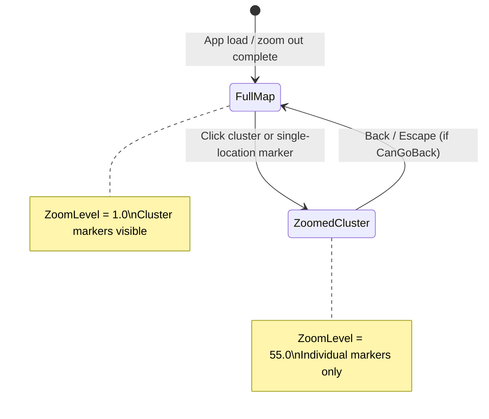

# Zoom Levels Audit — Intended vs Operational

Date: 2026-06-06  
Status: Investigation complete (read-only; no code changes)  
Related backlog: [TO_DO.md — Navigation & Zoom](../TO_DO.md)  
See also: [ZOOMED_REGION_CACHE_REGRESSION_ASSESSMENT.md](ZOOMED_REGION_CACHE_REGRESSION_ASSESSMENT.md), [UNZOOMED_MARKER_OFFSET_ASSESSMENT.md](UNZOOMED_MARKER_OFFSET_ASSESSMENT.md)

## Executive summary

| Question | Answer |
|----------|--------|
| **How many user-facing zoom states?** | **Two:** full-map cluster view (`ZoomLevel ≈ 1.0`) and fixed cluster zoom (`ZoomLevel = ZoomScale`, currently **55.0**). |
| **Does code match the original product intent?** | **Yes** for state *count* (two discrete resting states, no user-selectable intermediate levels). **No** for documentation and tuning (plans cite 3.0–3.5×; config uses 55×). |
| **Changed since March 18, 2026?** | **Zoom level count and core viewport math: no.** `ViewportState`, `ViewportCalculator`, `MapDisplayControl`, and `MapNavigationService` are **byte-identical** to commit `5f32adb`. `ZoomScale` was already **55.0** on March 18. Post–March 18 work refactored `MainWindow` animation wiring and fixed high-res cache source path — not the number of zoom states. |
| **Hidden complexity?** | Continuous `ZoomLevel` during animation (~30 keyframes, 1.0→55.0); radial-extension **threshold** at 10.0 (not a third user level); vestigial `ZoomState` navigation stack (depth 1, popped data unused). |

**Bottom line:** The app implements **two operational zoom states**, consistent with [MARKER_CLUSTERING_PLAN.md](../archive/planning/MARKER_CLUSTERING_PLAN.md) and [pin-parts-composite-placement-plan.md](../exec-plans/completed/pin-parts-composite-placement-plan.md). Docs and examples that mention 3.5× or arbitrary multi-level zoom are **stale**. The March 18 baseline already used viewport rendering and `ZoomScale: 55.0` — not the earlier transform-era `3.5` constant.

---

## What “zoom level” means in this codebase

The word is overloaded. Distinct concepts:

| Concept | Values today | User-visible? |
|---------|----------------|---------------|
| **Resting display state** | Full map vs zoomed cluster | Yes (2 states) |
| **`ViewportState.ZoomLevel`** | `1.0` at full map; `ZoomScale` (55.0) when zoomed; continuous during animation | Internal scalar, not a level picker |
| **`visual-config.json` → `ZoomScale`** | `55.0` — target magnification for cluster zoom | Config tuning, not “level 55 of N” |
| **`RadialExtension.ZoomThresholdForExtensions`** | `10.0` — minimum `ZoomLevel` to compute radial extensions | Feature gate, not a navigable zoom stop |
| **Future backlog** ([TO_DO.md](../TO_DO.md) “Zoom in/out on map”, “Pan/drag”) | Not implemented | N/A |

There is **no** enum, level index, or wheel/pinch step table. “Level” in layout keys (`LayoutKeyGenerator`, `ManualLayoutManager`) means the numeric `ZoomLevel` on the viewport at save time (effectively `1.0` or `55.0` at rest).

---

## Intended behavior (documentation)

### Primary spec: two states only

[MARKER_CLUSTERING_PLAN.md](../archive/planning/MARKER_CLUSTERING_PLAN.md) (Phase 3–3.4):

- “Only two states needed — zoomed in or zoomed out (no arbitrary levels)”
- “Only one zoom level — either zoomed in (on cluster) or zoomed out (full map)”
- Recommended `ZoomScale = 3.0` (historical tuning example)
- Navigation: Back returns to full map; stack tracks prior state

[exec-plans/completed/pin-parts-composite-placement-plan.md](../exec-plans/completed/pin-parts-composite-placement-plan.md) (2026):

- “Effectively operating in two display states” (full-map cluster view vs zoomed cluster view)
- No continuous re-clustering by zoom level

[VIEWPORT_ZOOM_PLAN.md](../archive/planning/VIEWPORT_ZOOM_PLAN.md):

- Introduced viewport rendering for performance
- Examples use `ZoomLevel` `1.0` (full) vs `3.5` (zoomed) — **illustrative**, predates `ZoomScale` 55
- Open items: remove legacy `IsZoomed`, test “all zoom levels” (meaning coordinate correctness across the scalar range, not N discrete UI levels)

### Explicitly not intended (yet)

[TO_DO.md](../TO_DO.md) Future Enhancements: “Zoom in/out on map”, “Pan/drag map navigation” — **not built**.

---

## Operational behavior (current code)

### Resting states (what the user can land on)

**Full-map view**

- `ViewportState.CreateFullMapView()` → `ZoomLevel = 1.0`
- Multi-location clusters show cluster markers; singles show individual markers
- Click cluster or individual marker (when `ZoomLevel <= 1.0`) → zoom in

**Zoomed cluster view**

- `ViewportState.CreateZoomedView(..., ZoomScale, ...)` → `ZoomLevel = ZoomScale` (**55.0**)
- Cluster markers hidden; individual markers for selected cluster only
- `ShowZoomedView` may swap display to high-res cached crop ([ZOOMED_REGION_CACHE_REGRESSION_ASSESSMENT.md](ZOOMED_REGION_CACHE_REGRESSION_ASSESSMENT.md))
- Click individual marker → content popup (no further zoom)
- Radial extensions when enabled and `ZoomLevel >= 10` (at rest always 55)

**No third resting state:** cannot zoom from cluster A to cluster B without returning to full map (cluster markers hidden while zoomed). Cannot pinch/wheel to arbitrary magnification.

### Transient behavior (animation only)

`AnimateViewportTransition` ([MainWindow.xaml.cs](../../MainWindow.xaml.cs)):

- Pre-renders **30 keyframes**; `ViewportCalculator.Interpolate` linearly lerps `ZoomLevel` from start to end (e.g. `1.0` → `55.0`)
- `_isAnimating = true` skips radial extension layout during animation
- User sees continuous zoom motion; **cannot stop at an intermediate level**

This is **not** a multi-level zoom product feature — it is animation interpolation.

### Navigation stack

`MapNavigationService` stores `ZoomState` (legacy transform-era model), not `ViewportState`:

- **Zoom in:** `PushState(ZoomState.CreateFullMapView())` — always the same placeholder
- **Zoom out:** `PopState()` — return value **is not used** to restore geometry; target is always `CreateFullMapView(...)` anew

Effective stack depth: **0 or 1** (`CanGoBack` is a boolean gate). Not multi-level history despite `Stack<>` type.

### Config (live)

From [visual-config.default.json](../../visual-config.default.json):

| Key | Value | Role |
|-----|-------|------|
| `ZoomScale` | **55.0** | Target `ZoomLevel` when zoomed in |
| `AnimationDurationMs` | 390 | Zoom animation duration |
| `RadialExtension.ZoomThresholdForExtensions` | **10.0** | Extension feature gate on `ZoomLevel` |

`VisualConfig.ZoomScale` default if JSON missing: **30.0** ([Models/VisualConfig.cs](../../Models/VisualConfig.cs)) — runtime uses checked-in JSON (55.0).

### Dead / unused zoom API

| API | Status |
|-----|--------|
| `ViewportCalculator.CalculateZoomToPoint` | Defined, **no callers** in repo |
| `ZoomState` scale/translate fields | Written only via `CreateFullMapView()` defaults; **not** used for viewport restore |
| `MapDisplayControl.IsZoomed` | Property exists; zoom decisions use `ZoomLevel` comparisons in `MainWindow` |
| Transform-based `MapDisplay.ScaleTransform` | Removed from active path (viewport crop replaces it) |

---

## March 18, 2026 baseline comparison

Reference commit: **`5f32adb`** (2026-03-18, “small updates to docs”) — end of a week of radial-line and edit-mode work.

### Same as today (zoom architecture)

Verified with `git diff 5f32adb HEAD -- Models/ViewportState.cs Services/ViewportCalculator.cs Services/MapNavigationService.cs Views/MapDisplayControl.xaml.cs` → **empty diff**.

On March 18 the code already had:

- Viewport-based `AnimateZoomToCluster` / `AnimateZoomOut`
- `ZoomScale: 55.0` and `ZoomThresholdForExtensions: 10.0` in `visual-config.json`
- Pre-rendered keyframe animation (~30 frames)
- `ZoomedRegionCache` (path since fixed in June 2026 — see regression assessment; does not change level *count*)

### Differs from today (not zoom level count)

| Area | March 18 | Today |
|------|----------|-------|
| `MainWindow.xaml.cs` | Inline animation loops | Shared `AnimateViewportTransition`; layout editor extracted partially |
| `visual-config.json` | Smaller (no pin parts block) | Adds pin/composite config; **ZoomScale unchanged at 55.0** |
| `ZoomedRegionCache` image path | Later regressed then fixed | Uses `GetFullResolutionWorldMapPath()` |

**Conclusion:** March 18 is a valid baseline for “how many zoom levels” — answer was already **two resting states** with **55×** cluster zoom, not 3.5×.

### Historical evolution (before March 18)

Git history shows **magnitude** tuning, not additional discrete levels:

| Approx. date | Commit theme | `ZoomScale` / zoom mechanism |
|------------|--------------|------------------------------|
| 2026-03-01 | Transform zoom | Hardcoded **3.5**, `ScaleTransform` on map |
| 2026-03-14 | Viewport refactor + “increase zoom” | **3.5 → 10 → 30** (same day), viewport `CreateZoomedView` |
| 2026-03-17 | `visual-config.json` | Moved to config; code reads `_visualConfig.ZoomScale` |
| 2026-03-18 | Radial lines / edit mode | Config **55.0** |
| 2026-06-05 | Cache source fix | Still **55.0** |

The **viewport architecture** landed ~March 14; **55.0** landed by March 18. Original clustering plan’s **3.0×** recommendation was superseded in code months before this audit, without updating the plan doc.

---

## Hypotheses challenged

### H1: “Viewport refactor introduced multi-level zoom”

**Rejected.** Viewport uses a continuous `ZoomLevel` scalar for animation and math, but UI exposes only two resting states. Same as March 18.

### H2: “March 18 had fewer zoom levels than today”

**Rejected** for level count. March 18 already had 55× and viewport interpolation. Today adds composite pins, layout variants, and refactored animation helper — not new zoom stops.

### H3: “ZoomScale 55 means 55 discrete levels”

**Rejected.** `ZoomScale` is a **single target magnification** passed to `CreateZoomedView`. Viewport size divides by this factor; it is not an index into a level table.

### H4: “Radial threshold 10 adds a third user zoom level”

**Rejected.** Threshold only gates extension rendering on `ZoomLevel >= 10`. During animation, extensions are disabled while `_isAnimating`. At rest, zoomed view is always 55. Users never “stay” at level 10.

### H5: “Navigation stack enables nested zoom levels”

**Rejected.** Stack depth is at most one; popped `ZoomState` is discarded for geometry. Back always animates to `CreateFullMapView`, not to an arbitrary prior viewport.

### H6: “Docs and code disagree on level count”

**Partially true, misleading wording.** Docs disagree on **magnification** (3.0–3.5× examples vs 55× config), not on **state count**. Two-state intent in clustering plan matches runtime.

---

## Spec vs implementation matrix

| Requirement | Spec source | Implementation | Match? |
|-------------|-------------|----------------|--------|
| Two resting zoom states | MARKER_CLUSTERING_PLAN, pin-parts plan | Full map + cluster zoom only | ✅ |
| No arbitrary user zoom stops | MARKER_CLUSTERING_PLAN §3.4 | No wheel/pinch/step UI | ✅ |
| Fixed cluster zoom magnification | Plan examples 3–3.5× | Config **55×** | ⚠️ tuning drift |
| Back navigation to full map | Phase 5 clustering plan | `AnimateZoomOut` → `ShowClusterView` | ✅ |
| Multi-level zoom history | Not specified | Stack unused for geometry | ✅ (absent) |
| Continuous pan/zoom | TO_DO future | Not implemented | ✅ (deferred) |
| Marker re-clustering by zoom | Not intended | Clusters fixed at load | ✅ |
| Coordinate correctness at all `ZoomLevel` values | VIEWPORT_ZOOM_PLAN testing | Known unzoomed offset at 1.0 — [UNZOOMED_MARKER_OFFSET_ASSESSMENT.md](UNZOOMED_MARKER_OFFSET_ASSESSMENT.md) | ⚠️ separate bug |

---

## Open questions / follow-ups (for future plans, not this audit)

1. **Documentation cleanup:** Update MARKER_CLUSTERING_PLAN, VIEWPORT_ZOOM_PLAN, and README examples to say `ZoomScale` 55× (or whatever product target is), not 3.0–3.5×.
2. **Tuning vs levels:** If zoom feels “too aggressive,” that is **`ZoomScale` tuning**, not missing intermediate levels — already noted in [ZOOMED_REGION_CACHE_REGRESSION_ASSESSMENT.md](ZOOMED_REGION_CACHE_REGRESSION_ASSESSMENT.md).
3. **Legacy `ZoomState`:** Consider removing or rewiring navigation to store `ViewportState` snapshots if true multi-level history is ever desired.
4. **Unzoomed marker alignment:** Separate fix at `ZoomLevel = 1.0`; does not imply extra zoom levels.
5. **Future multi-level zoom:** Would require new UX (wheel, pinch, level picker) and explicit spec — currently only in TO_DO future enhancements.

---

## Verification checklist (runtime, optional)

No code was run for this audit. To confirm in the app:

1. At load: log `MapDisplay.CurrentViewport.ZoomLevel` → expect **1.0**.
2. After cluster click completes: expect **55.0** (or current `ZoomScale`).
3. During animation: log frames → expect monotonic **1.0…55.0**; no user hold at intermediate values.
4. While zoomed: confirm cluster markers hidden; click second cluster impossible without Back.
5. Compare logs to March 18 build at `5f32adb` — same two resting values expected.

---

## References

- [MARKER_CLUSTERING_PLAN.md](../archive/planning/MARKER_CLUSTERING_PLAN.md)
- [VIEWPORT_ZOOM_PLAN.md](../archive/planning/VIEWPORT_ZOOM_PLAN.md)
- [exec-plans/completed/pin-parts-composite-placement-plan.md](../exec-plans/completed/pin-parts-composite-placement-plan.md)
- [ZOOMED_REGION_CACHE_REGRESSION_ASSESSMENT.md](ZOOMED_REGION_CACHE_REGRESSION_ASSESSMENT.md)
- [TO_DO.md](../TO_DO.md)
- Git baseline: `5f32adb` (2026-03-18)
